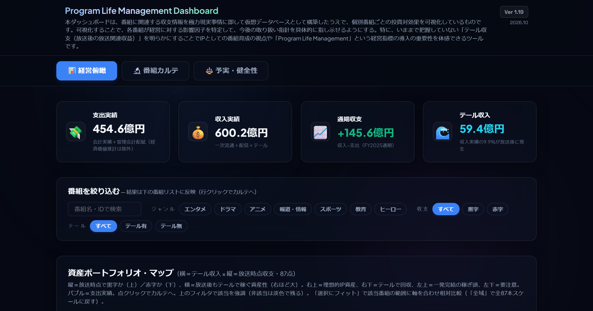

# Program Life Management Dashboard (番組軸PLM 資産ポートフォリオ・ダッシュボード)

テレビ番組を単なる「枠の消費財」ではなく「投資回収と長期資産（IP）のポートフォリオ」として捉え直し、全社視点での俯瞰から個別番組の収支構造・回収動態までをインタラクティブに可視化・検証するシングルページ・ダッシュボード（SPA）です。

---

## 🌐 インタラクティブ・ダッシュボード（Live Demo）

ブラウザ上でインストール不要・完全スタンドアロンで即座に動作します：
👉 **[Live Dashboard を開く（GitHub Pages）](https://naohisastry.github.io/program-life-management-dashboard/)**

---

## 🎯 開発の背景と目的

本ダッシュボードは、番組に関連する収支情報を極力現実事情に即して仮想データベースとして構築したうえで、個別番組ごとの投資対効果を可視化しているものです。可視化することで、各番組が経営に対する影響因子を特定して、今後の取り扱い指針を具体的に指し示せるようにする。特に、いままで把握していない「テール収支（放送後の放送関連収益）」を明らかにすることでIPとしての番組育成の視点や「Program Life Management」という経営指標の導入の重要性を体感できるツールです。

---

## 📊 主要機能と3つのビュー

### ① 📊 経営俯瞰 (`Overview`)
- **全社KPIスコアカード**: 支出実績、収入実績、通期収支、テール収入の全社集計
- **番組多角フィルタ**: ジャンル（ドラマ・バラエティ・アニメ・報道情報・ヒーロー等）、通期収支（黒字・赤字）、テール有無による即時フィルタリング
- **資産ポートフォリオ・マップ**: 横軸「テール収入」× 縦軸「放送時点収支」による散布図バブルチャート。右上（理想的IP資産）、右下（テール回収型）、左上（一発完結型稼ぎ頭）、左下（要注意・改善要）の4象限評価
- **番組一覧テーブル**: 多彩な指標（支出・収入・通期収支・放送時点・テール・回収率）による多角ソート機能

### ② 🔬 番組カルテ (`Karte`)
- **番組セレクター**: 曜日・時間帯・ジャンル・並び順から目的の1本を瞬時に特定
- **四半期キャッシュフロー（CF）推移**: 四半期純額（棒）と累積収支推移（線）によるゼロ交差（損益分岐）の可視化
- **二段構造分析**: 「放送時点収支（一次流通）」から「テール収支（二次利用・配信・海外ライセンス）」への寄与分解
- **費目別内訳（実績上位）**: 制作費・キャスト料・設備費等の支出内訳と、タイム・スポット・SVOD等の収入構成比
- **機械導出構造指標**: 回収率（収入÷支出）、テール比率、人気Tier（S/A/B/C/D）、PLM管理タイプ4分類

### ③ ⚖️ 予実・健全性 (`Variance`)
- **架空番組によるシナリオ再現**: 実在番組へのネガティブ差異紐づけを排し、架空3番組専任で予実超過・早期打ち切り・海外フォーマット輸出の歪みを再現
- **項目別予実差サマリー**: どの費目・収入項目が差異の主因となっているかの集約表
- **慣行取引の勘定化**: 出演料事後決定差額、キープ拘束機会費用、バーター出演等の慣行を正規の管理会計・推計行として透明化

---

## 🛠️ 技術スタック
- **Frontend**: Vanilla JavaScript (ES6+), HTML5, CSS3 (Modern Glassmorphism & Neon Dark Theme)
- **Visualization**: Chart.js 4.x
- **Data Pipeline**: Python 3.11+, Pandas (v3.0 生成パイプライン・P0〜P5 fail-closed整合性ゲート)
- **Deployment**: GitHub Pages (Standalone Zero-Dependency SPA)

---

## 📄 ドキュメント一覧
- [分析手法・数理モデル仕様書 (METHODOLOGY.md)](METHODOLOGY.md)
- [データ出典・台帳設計書 (DATA_SOURCES.md)](DATA_SOURCES.md)
- [更新履歴 (CHANGELOG.md)](CHANGELOG.md)

---

## 👤 作成者情報
- **企画・分析・データ設計**: Naohisa Hashimoto (Media Architect)
- **GitHub**: [@naohisastry](https://github.com/naohisastry)
- **Portfolio**: [naohisastry.github.io](https://naohisastry.github.io/)

---

## 📄 License / ライセンス

- **Code**（HTML / CSS / JavaScript）: [MIT License](LICENSE)
- **Content**（文章・図表・分析結果・整理済みデータ）: [CC BY 4.0](LICENSE-CONTENT.md)
- 出典表示例 / Attribution: Naohisa Hashimoto, "program-life-management-dashboard", https://naohisastry.github.io/program-life-management-dashboard/
- 第三者の元データの権利は各発行元に帰属します。 / Third-party source data remain the property of their original publishers.

© 2026 Naohisa Hashimoto
